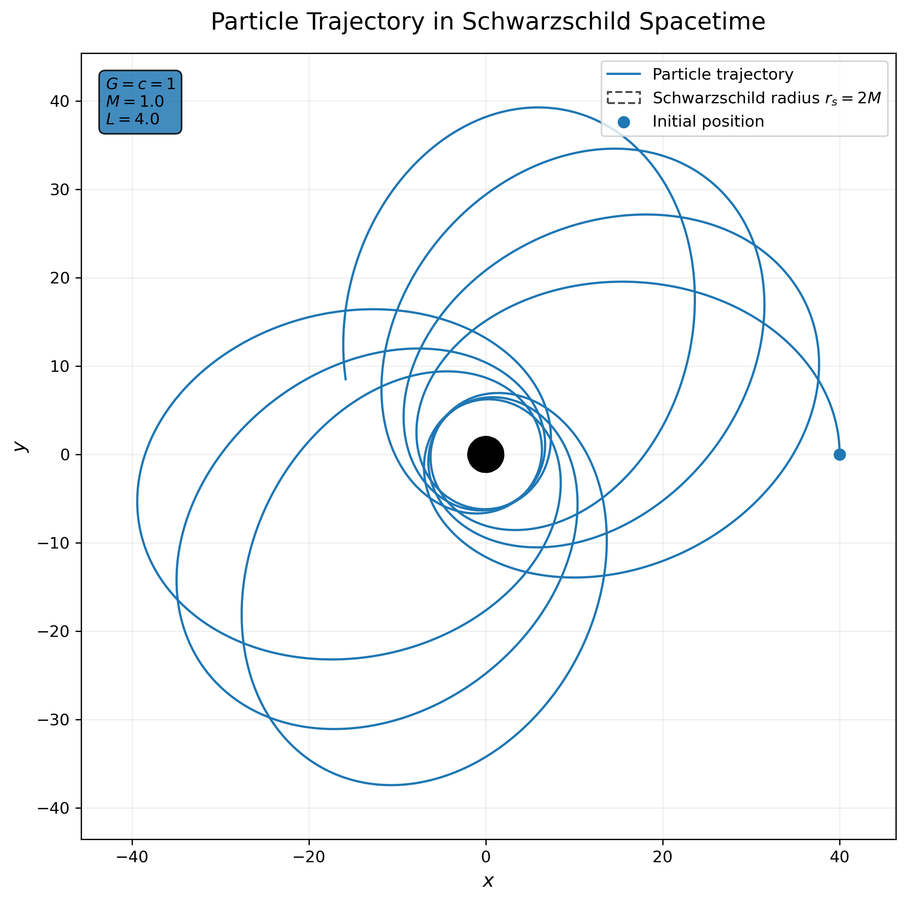
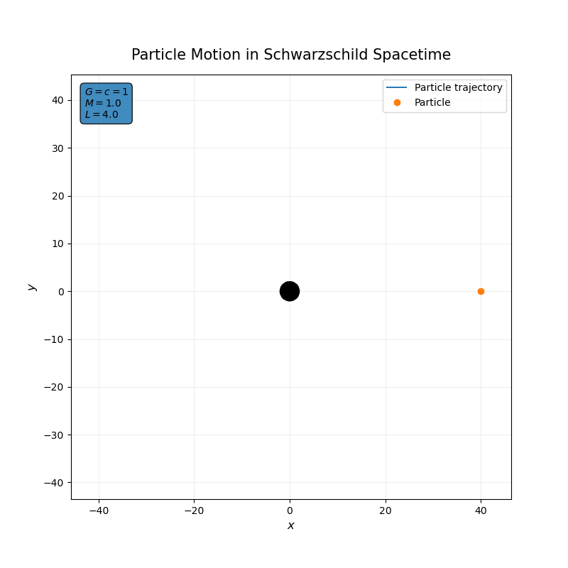

# Schwarzschild-orbital-motion

A numerical simulation of particle motion in the Schwarzschild spacetime using Python. The project integrates the geodesic equations for a test particle orbiting a non-rotating, spherically symmetric black hole and visualizes the resulting trajectory.

## Overview

In General Relativity, a freely falling particle follows a **geodesic** of spacetime rather than experiencing gravity as a conventional Newtonian force. For a non-rotating black hole, the spacetime geometry is described by the Schwarzschild metric.

Using geometrized units,

$$
G=c=1,
$$

the Schwarzschild metric in the equatorial plane is

$$
ds^2 =
-\left(1-\frac{2M}{r}\right)dt^2
+\left(1-\frac{2M}{r}\right)^{-1}dr^2
+r^2d\phi^2.
$$

The simulation numerically solves the corresponding radial and angular geodesic equations and converts the resulting polar coordinates into Cartesian coordinates for visualization.

## Physics

For equatorial motion, the equations used in the simulation are

$$
\frac{d^2r}{d\tau^2}=
-\frac{M}{r^2}
+\frac{L^2}{r^3}
-\frac{3ML^2}{r^4}
$$

and

$$
\frac{d\phi}{d\tau}=\frac{L}{r^2},
$$

where:

* $r$ is the radial coordinate,
* $\phi$ is the azimuthal coordinate,
* $\tau$ is the particle's proper time,
* $M$ is the black-hole mass parameter,
* $L$ is the particle's specific angular momentum.

The radial equation contains three contributions:

$$
-\frac{M}{r^2}
$$

is the attractive Newtonian-like term,

$$
+\frac{L^2}{r^3}
$$

arises from angular motion, and

$$
-\frac{3ML^2}{r^4}
$$

is the relativistic correction responsible for effects that have no Newtonian counterpart.

The Schwarzschild radius in geometrized units is

$$
r_s=2M.
$$

For the parameters used in this simulation,

$$
M=1,\qquad L=4,
$$

so the event-horizon radius is

$$
r_s=2.
$$

## Numerical Method

The system of second-order equations is rewritten as a first-order system and integrated using `scipy.integrate.solve_ivp`.

The simulation uses the high-order `DOP853` integration method with tight relative and absolute tolerances.

Initial conditions:

$$
r(0)=40,\qquad
\dot r(0)=0,\qquad
\phi(0)=0.
$$

The integration is performed over

$$
0\leq\tau\leq5000.
$$

The numerical solution is then transformed from polar to Cartesian coordinates:

$$
x=r\cos\phi,
\qquad
y=r\sin\phi.
$$

## Results

### Particle trajectory



### Animation



The trajectory illustrates the relativistic orbital dynamics produced by the Schwarzschild geodesic equations. The black circle represents the Schwarzschild radius, while the plotted curve represents the test-particle trajectory.

## Project Structure

```text
schwarzschild-orbital-motion/
├── src/
│   └── orbits.py
├── figures/
│   ├── schwarzschild_orbit.png
│   └── schwarzschild_orbit.gif
├── README.md
├── requirements.txt
├── LICENSE
└── .gitignore
```

## Installation

Clone the repository:

```bash
git clone <repository-url>
cd schwarzschild-orbital-motion
```

The simulation requires:

* NumPy
* SciPy
* Matplotlib
* Pillow

## Running the Simulation

Run the main script with:

```bash
python src/orbits.py
```

The script numerically integrates the geodesic equations and generates:

* `figures/schwarzschild_orbit.png` — static trajectory
* `figures/schwarzschild_orbit.gif` — animated trajectory

## Units

The simulation uses **geometrized units**:

$$
G=c=1.
$$

In these units, mass, length, and time can be expressed in compatible geometric units, which simplifies the equations considerably.

The simulation is therefore intended to demonstrate the structure of Schwarzschild geodesic motion rather than represent a particular physical black hole with a specified mass in SI units.

## References

* S. Carroll, *Spacetime and Geometry: An Introduction to General Relativity*, Addison-Wesley.
* R. M. Wald, *General Relativity*, University of Chicago Press.
* C. W. Misner, K. S. Thorne, and J. A. Wheeler, *Gravitation*, W. H. Freeman.
